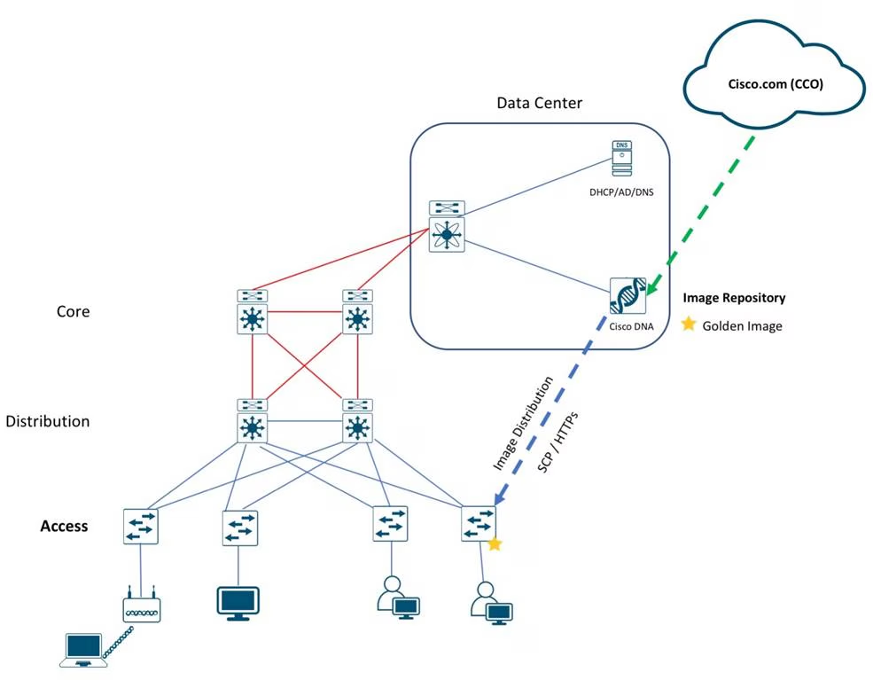

# Campus Software Image Management (SWIM) Using Cisco DNA Center Deployment Guide

# References
1. https://www.cisco.com/c/en/us/td/docs/solutions/CVD/Campus/dnac-swim-deployment-guide.html

# Use case
1. Standardize software images for your network devices with software image management (SWIM).

# Summary
Cisco DNA Center is designed for intent-based networking (IBN). The solution breaks the process in to Day 0 and Day N. The solution provides a unified approach to provision enterprise networks comprised of Cisco routers, switches, and wireless devices with a near zero touch deployment experience.

Zero-touch device connectivity and Software Image Management (SWIM) features reduce device installation and upgrade times from hours to minutes and bring new remote offices online with plug-and-play ease from an off-the-shelf Cisco device. Software Image Management (SWIM) manages software upgrades and controls the consistency of image versions across your network.

# Topology

